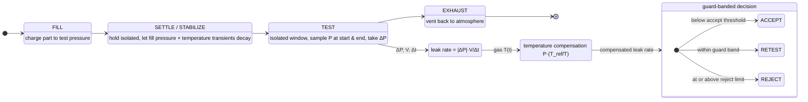
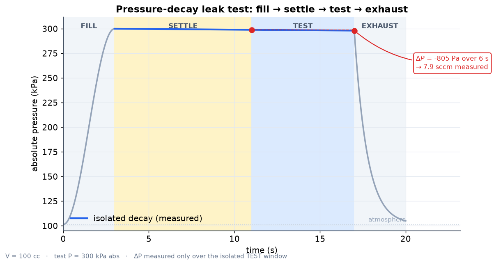
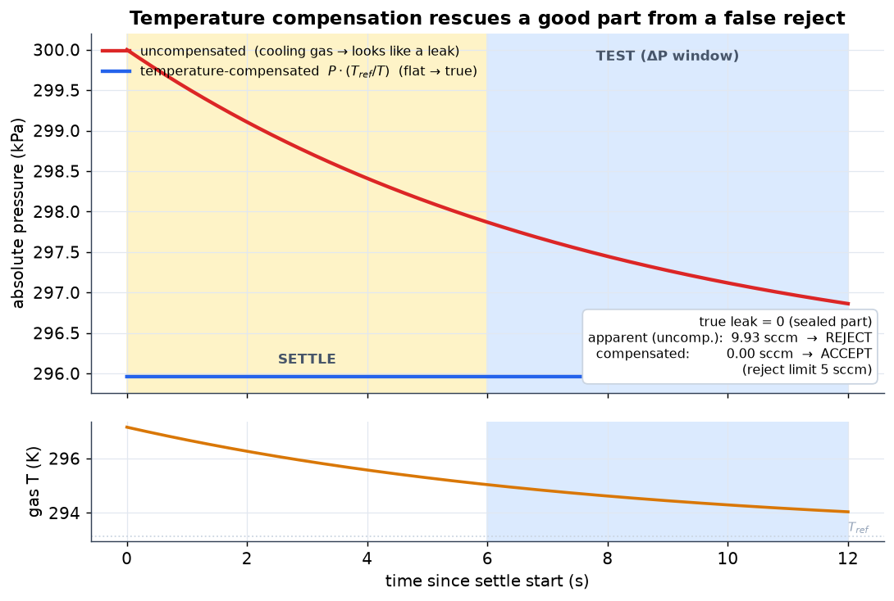
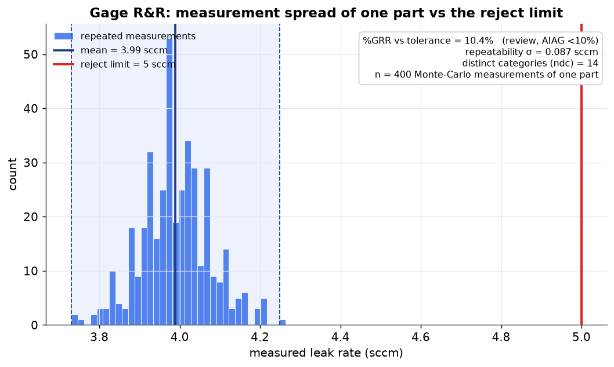
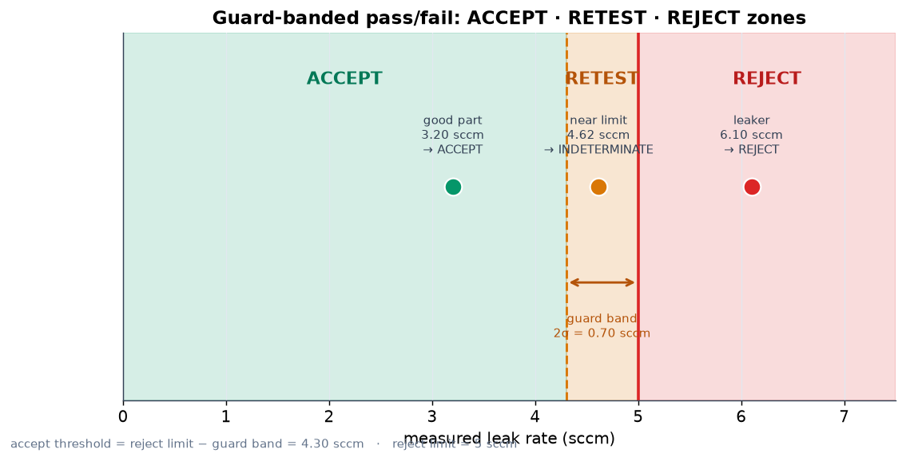
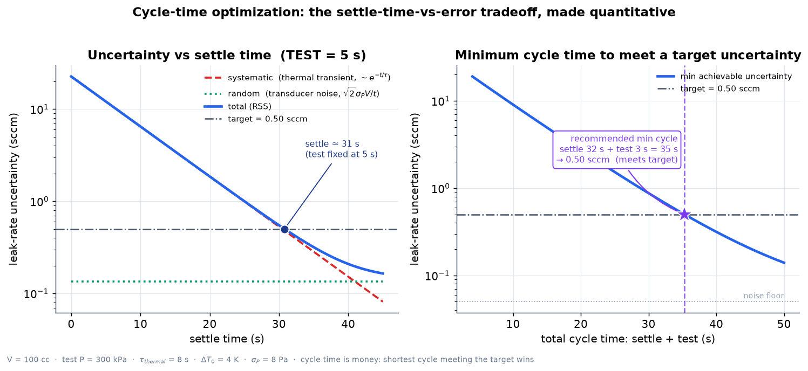

# leak-test-sim

[](https://github.com/earosenfeld/leak-test-sim/actions/workflows/ci.yml)

A physically-correct **pressure-decay & flow leak-test simulator** for manufacturing
quality engineering. It models the full test the way production instruments
(Cincinnati Test Systems, ATEQ, Zaxis) run it — **fill → settle → test → exhaust** —
with ideal-gas pressure decay, the dominant **temperature-transient** false-reject
mechanism and its compensation, instrument noise / resolution / drift, guard-banded
pass/fail, and stretch physics for flow regimes, gas correlation, and Gage R&R.

Everything is validated against **closed-form** leak-test relationships in the test
suite (75 tests). No hand-waving: given a known volume and conductance, the simulator
reproduces the analytic `ΔP`, `τ`, and leak rate to tolerance.

### Test-sequence state machine



---

## Visualizations

Generated from the real API by [`scripts/make_figures.py`](scripts/make_figures.py)
(`.venv/bin/python scripts/make_figures.py`) — every trace is simulated, not drawn.

### Pressure-decay sequence — the full cycle



Pressure across **fill → settle → test → exhaust** (phases shaded). The part is
isolated through settle + test; ΔP is taken **only over the TEST window** and
converted to a leak rate.

### Temperature compensation — the differentiator



A **perfectly sealed part (zero real leak)** with a fill-heating transient. The
**uncompensated** trace (red) cools and falls — reading ~10 sccm, a **false
reject**. The **temperature-compensated** trace `P·(T_ref/T)` (blue) stays flat
→ **0 sccm → accept**. This is the headline value of a real leak-test station.

### Gage R&R — measurement capability



400 Monte-Carlo measurements of **one part** (instrument noise only). The spread
is the gauge **repeatability**; `%GRR`, `σ` and number of distinct categories
(ndc) gauge whether the tester can be trusted against the tolerance.

### Guard-banded decision — accept / retest / reject



The guard band pulls the accept threshold in by the measurement uncertainty,
splitting the scale into **ACCEPT · RETEST · REJECT**. Example points are placed
and classified by the real `decide()`.

### Cycle-time optimization — the settle-vs-error tradeoff


On a line, every second of **settle + test** is throughput. Longer **settle**
lets the fill thermal transient decay (smaller *systematic* error,
`~exp(-settle/τ)`); longer **test** grows the ΔP signal against transducer noise
(smaller *random* error, `~1/test`). `optimize_cycle_time()` finds the **shortest
total cycle** whose RSS uncertainty still meets the target — here ~35 s.

---

## The physics

### 1. Pressure decay → leak rate (the core)

A sealed test volume `V` (m³) at absolute pressure `P` (Pa) leaks to atmosphere
`P_atm` through a leak path of **conductance** `C` (m³/s). The molar balance from the
ideal gas law `PV = nRT` (isothermal, fixed `V`) gives a first-order ODE in the
*gauge* pressure:

```
dP/dt = −(C / V) · (P − P_atm)
```

which integrates to an **exponential decay** with time constant `τ = V / C`:

```
P(t) − P_atm = (P0 − P_atm) · exp(−t / τ)
```

The **instantaneous leak rate** (throughput, in Pa·m³/s) is:

```
Q(t) = C · (P(t) − P_atm)        # gas leaving the volume per unit time
```

A pressure-decay instrument doesn't measure `Q` directly. It fills, settles, then
watches the pressure fall by `ΔP` over a fixed **test window** `Δt` and infers:

```
Q_measured ≈ |ΔP| · V / Δt
```

This is **exact in the limit `Δt → 0`** and a small under-estimate for finite `Δt`
(the instrument sees the *average* slope, slightly below the initial `Q0` because the
decay is exponential). `leak_rate_from_decay()` returns the measured value;
`leak_rate_exact_window()` returns the exponential-corrected value so you can compare.

> **Validation** (`tests/test_physics.py`): given `V` and `C`, the simulated `ΔP`
> over `Δt` recovers `Q = |ΔP|·V/Δt` to <1% for a short window, and the ODE
> integrator matches the closed-form `P(t)` to <1 Pa over the whole trace; `τ = V/C`.

### 2. Temperature compensation (the differentiator)

The **dominant false-reject source** in pressure decay is not real leaks — it's
temperature. Filling a part compresses and warms the gas; the walls then pull that
heat away and the gas cools during settle/test. At fixed `V` and `n` the ideal gas
law gives:

```
ΔP / P = ΔT / T          ⇒        ΔP = P · ΔT / T
```

So a cooling gas (`ΔT < 0`) drops pressure **with no real leak** — indistinguishable
from a leak to an uncompensated instrument. A 1 K cool-down on a part at 300 kPa,
293 K fakes `ΔP = 300000 · (−1)/293 ≈ −1024 Pa`, which on a small volume dwarfs the
reject leak rate.

Active **temperature compensation** corrects each pressure reading to a reference
temperature:

```
P_corr(t) = P(t) · (T_ref / T(t))
```

Genuine mass loss survives this correction; pure thermal drift cancels.

> **Validation** (`tests/test_temperature.py`): a pure thermal transient with **zero
> real leak** makes the uncompensated reading exceed the reject limit (false reject),
> while the compensated reading collapses to <1% of it (accept). A second test
> confirms compensation **preserves a genuine leak** rather than erasing it.

### 3. Leak-rate units

The SI leak rate is a throughput, `Pa·m³/s`. Industry uses several units, defined
*exactly* by:

| Unit | Definition | = Pa·m³/s |
|---|---|---|
| `1 sccm` | `101325 Pa × 1e-6 m³ / 60 s` | `1.68875e-3` |
| `1 scc/s` | `101325 Pa × 1e-6 m³` (= 60 sccm) | `0.101325` |
| `1 mbar·L/s` | `100 Pa × 1e-3 m³` | `0.1` |
| `1 atm·cc/s` | `101325 Pa × 1e-6 m³` | `0.101325` |

The "standard" pressure baked into sccm is `P_STD = 101325 Pa` (exposed as a constant,
not a magic number). All conversions round-trip exactly (`tests/test_units.py`).

### 4. Pass/fail with a guard band

Compare the measured leak rate against a **reject limit**. Because the measurement has
uncertainty, a **guard band** pulls the accept threshold in by the gauge uncertainty:

```
measured ≥ reject_limit                 → REJECT          (clearly too leaky)
measured < reject_limit − guard_band    → ACCEPT          (clearly good)
otherwise                               → INDETERMINATE   (retest)
```

Guarding only the accept side is the conservative, ship-no-bad-parts convention used
on production testers. The guard band is typically `k·σ` of the gauge repeatability.

### 5. Instrument realism, flow regimes, Gage R&R (stretch)

- **Transducer**: finite resolution (ADC quantisation), Gaussian noise, baseline
  drift — the real contributors to measurement repeatability.
- **Flow regimes**: classify a leak channel by **Knudsen number** `Kn = λ/d`
  (continuum / transitional / molecular); Poiseuille vs molecular tube conductances.
- **Gas correlation**: air-on-the-line vs helium-spec. Viscous flow `∝ 1/η`
  (air leaks faster, `η_air=1.81e-5`, `η_He=1.96e-5`); molecular flow `∝ 1/√MW`
  (helium leaks ~2.69× faster, `MW_air=28.97`, `MW_He=4.0`).
- **Gage R&R**: Monte-Carlo repeated measurements → repeatability σ, %GRR vs
  tolerance, number of distinct categories (AIAG MSA). A closed-form
  `σ_leak = √2 · σ_noise · V / Δt` cross-checks the Monte-Carlo result.

---

## Cycle-time optimization

On a production line **cycle time is money** — every second of *settle* + *test*
is a part the station can't make. But cutting those times degrades the
measurement two competing ways, so the minimum cycle that still meets a target
uncertainty can be **computed** (`leak_test_sim/optimization.py`), not guessed.



### The uncertainty model

The measured leak rate `Q = |ΔP|·V/test` carries two independent errors:

| Term | Driver | Form | Shrinks with |
|---|---|---|---|
| **Systematic** | residual fill **thermal transient** still decaying into the test window | `e_sys = \|P·ΔT_win/T\|·V/test`,  `ΔT_win = ΔT₀·e^(−settle/τ)·(1−e^(−test/τ))` | **settle** (`~e^(−settle/τ)`) |
| **Random** | **transducer noise** on the two ΔP endpoint samples | `e_noise = √2·σ_P·V/test` (= the Gage R&R repeatability) | **test** (`~1/test`) |

They combine as a **root-sum-square**, with an optional irreducible floor
(drift / resolution / temperature-sensor accuracy):

```
u(settle, test) = √( e_sys² + e_noise² + noise_floor² )
```

`u` is **monotone decreasing** in both settle (systematic decays) and test (noise
decays), flattening toward `noise_floor`. The systematic term reuses the real
ideal-gas relation `apparent_dp_from_dt()`; the noise term *is*
`noise_to_leak_rate_sigma()` from the Gage R&R module — so the model is the
closed form of the same physics the full sequence simulator integrates.

### Finding the minimum cycle

```python
from leak_test_sim import UncertaintyModel, optimize_cycle_time, sccm_to_pa_m3_s, pa_m3_s_to_sccm

m = UncertaintyModel(test_pressure=300_000.0, volume=1e-4,
                     dT0=4.0, tau_thermal=8.0, sigma_P=8.0)
rec = optimize_cycle_time(sccm_to_pa_m3_s(0.5), m)     # target = 0.5 sccm

print(rec.settle_t, rec.test_t, rec.total_t)           # ≈ 31.5 s + 4.0 s = 35.5 s
print(pa_m3_s_to_sccm(rec.uncertainty), rec.met)       # ≈ 0.50 sccm, True
```

`optimize_cycle_time()` scans the `(settle, test)` plane and returns the pair with
the **smallest total cycle** whose modelled `u ≤ target`. A tighter target costs
more time; a target below the floor is flagged `feasible=False` and the
closest-achievable point is returned.

### Early stop with a Wald SPRT

For lines where most parts are clearly good (or clearly bad),
`sequential_decision()` runs a **Sequential Probability Ratio Test**: it samples
the gauge pressure and accepts/rejects the instant the accumulating leak signal
crosses Wald's log-likelihood bounds — cutting the **average** test time far below
a fixed window while holding the type-I/type-II error rates.

```python
from leak_test_sim import sequential_decision, conductance_from_leak_rate

reject = sccm_to_pa_m3_s(5.0)
good = conductance_from_leak_rate(sccm_to_pa_m3_s(1.0), m.test_pressure)
res = sequential_decision(reject, m, C=good, max_test_time=30.0, settle_t=15.0)
print(res.decision, res.test_time)     # accept, well under the 30 s window
```

`settle_t` references the thermal profile to the start of settle, so the SPRT
sees only the **residual** transient — too short a settle can still false-reject a
good part (exactly the tradeoff above); an adequate settle clears it.

---

## Worked example

A 100 cc part at 300 kPa absolute with a planted **4 sccm** leak, a 4 K fill-heating
transient (`τ_thermal = 8 s`), and a noisy transducer, tested against a **5 sccm**
reject limit:

```
TEST window: dP over 5 s = −1007 Pa
  UNCOMPENSATED leak rate :  11.93 sccm   →  REJECT   (false reject from cooling)
  COMPENSATED   leak rate :   3.75 sccm   →  ACCEPT   (recovers the true ~4 sccm)

SETTLE-TIME vs ERROR (zero real leak, pure thermal):
   settle(s)   false leak (sccm)
        1            19.6
        5            11.9
       20             1.8
       40             0.15        ← longer settle drives the false reading to zero

GAGE R&R:  σ = 0.082 sccm,  %GRR = 9.87%  (capable),  ndc = 14
GAS CORRELATION (4 sccm air):  molecular → 10.76 sccm He,  viscous → 3.69 sccm He
```

The uncompensated channel **false-rejects a good part** purely from the fill
transient; temperature compensation recovers the true leak and the part passes. This
is the headline value proposition of a real leak-test station, reproduced from first
principles.

Run it:

```bash
python examples/run_leak_test.py
```

---

## Install & run

```bash
cd leak-test-sim
# with uv
uv venv .venv --python 3.11
uv pip install --python .venv/bin/python -e '.[plot,dev]'

# or plain pip
python -m venv .venv && source .venv/bin/activate
pip install -e '.[plot,dev]'

.venv/bin/python -m pytest -q          # 75 tests, all green
.venv/bin/python examples/run_leak_test.py
```

Python ≥ 3.10. Runtime deps: `numpy`, `scipy`. (`matplotlib` only for optional plots.)

## Package layout

```
leak_test_sim/
├── units.py         # exact leak-rate unit conversions (sccm ↔ Pa·m³/s ↔ mbar·L/s ↔ scc/s)
├── physics.py       # pressure decay ODE + closed form, Q↔C, ideal-gas thermal term
├── temperature.py   # fill-heat/cool transient + P_corr = P·(T_ref/T) compensation
├── instrument.py    # transducer resolution / Gaussian noise / baseline drift
├── sequence.py      # fill→settle→test→exhaust state machine + settle/error tradeoff
├── decision.py      # guard-banded accept / reject / indeterminate
├── flow.py          # Knudsen number, Poiseuille vs molecular, air↔He correlation
└── gage_rr.py       # Monte-Carlo measurement capability (%GRR, ndc)
tests/               # 75 closed-form validation tests
examples/run_leak_test.py
```

## Quick API

```python
from leak_test_sim import (
    SequenceConfig, run_sequence, ThermalTransient, Transducer,
    DecisionConfig, decide, conductance_from_leak_rate, sccm_to_pa_m3_s, all_units,
)

cfg = SequenceConfig(test_pressure=300_000.0, volume=1e-4,
                     settle_time=8.0, test_time=5.0)
C = conductance_from_leak_rate(sccm_to_pa_m3_s(4.0), cfg.test_pressure)
thermal = ThermalTransient(dT0=4.0, tau_thermal=8.0)

res = run_sequence(cfg, C=C, temp_profile=thermal, T_ref=293.15,
                   transducer=Transducer(noise_std=5.0, seed=7))

print(all_units(abs(res.leak_rate_si_compensated)))      # leak rate in every unit
print(decide(abs(res.leak_rate_si_compensated),
             DecisionConfig(reject_limit=sccm_to_pa_m3_s(5.0))).verdict)
```

## License

MIT
